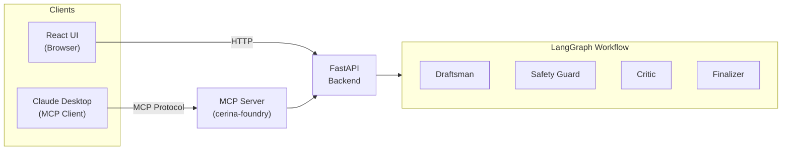
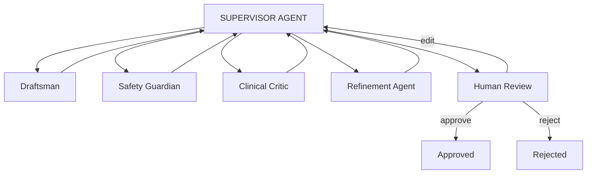

## Overview

Cerina implements a supervisor-worker pattern using LangGraph to orchestrate specialized agents that collaboratively create CBT content. The system ensures clinical safety and quality through multiple review stages before human approval.

### Agent Roles

- **Draftsman** - Generates and revises CBT exercise content
- **Safety Guardian** - Validates against self-harm risks and medical boundaries
- **Clinical Critic** - Ensures empathy, tone, and clinical accuracy
- **Finalizer** - Prepares final output for human review

### Architecture

The system consists of three main components:

- **Agent System** - LangGraph-based multi-agent orchestration
- **Backend API** - FastAPI REST service with PostgreSQL persistence
- **Frontend Dashboard** - Next.js web interface for session management



### Agentic Workflow



## Getting Started

### Requirements

- Python 3.13 or higher
- PostgreSQL 16 or higher
- Node.js 18 or higher (for frontend)
- uv package manager

### Installation

Start the database:

```bash
docker-compose up -d
```

Configure environment variables:

```bash
cp .env.example backend/.env
```

Set your API keys in the `.env` file:

```env
ANTHROPIC_API_KEY=your_key_here
OPENAI_API_KEY=your_key_here
```

Install Python dependencies:

```bash
cd backend
uv sync
```

Run the backend server:

```bash
uv run python -m src.main
```

The API will be available at `http://localhost:8000`.

### Frontend (Optional)

```bash
cd frontend
npm install
npm run dev
```

Access the dashboard at `http://localhost:3000`.

## API Reference

### Sessions

- `POST /api/v1/sessions` - Create new session
- `GET /api/v1/sessions` - List all sessions
- `GET /api/v1/sessions/{id}` - Retrieve session details
- `DELETE /api/v1/sessions/{id}` - Delete session
- `POST /api/v1/sessions/{id}/review` - Submit review decision
- `GET /api/v1/sessions/{id}/stream` - Server-sent events stream

### Exercises

- `GET /api/v1/exercises` - List approved exercises
- `GET /api/v1/exercises/{id}` - Retrieve exercise details

## Usage Example

Create a new session:

```bash
curl -X POST http://localhost:8000/api/v1/sessions \
  -H "Content-Type: application/json" \
  -d '{"user_input": "Create an exposure hierarchy for agoraphobia"}'
```

Submit a review:

```bash
curl -X POST http://localhost:8000/api/v1/sessions/\{session_id\}/review \
  -H "Content-Type: application/json" \
  -d '{"decision": "approve", "reviewer_id": "reviewer-1"}'
```

## Configuration

### LLM Provider

Configure the language model provider in your `.env` file:

```env
LLM_PROVIDER=anthropic  # or openai
```

### Observability

Enable LangSmith tracing:

```env
LANGCHAIN_TRACING_V2=true
LANGCHAIN_API_KEY=your_langsmith_key
LANGCHAIN_PROJECT=cerina
```

## Development

Apply database migrations:

```bash
cd backend
uv run alembic upgrade head
```
